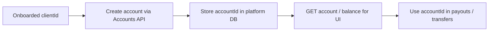

# Accounts

Create and manage accounts used for Embedded Payments balances and money movement after (or as part of) client onboarding.

## When to use

- Provision limited accounts for onboarded clients
- Create transaction accounts for the platform or counterparties
- Read balances / account details for dashboards

## Docs

| Resource | URL |
| --- | --- |
| Embedded Payments overview | https://developer.payments.jpmorgan.com/docs/embedded-finance-solutions/embedded-payments |
| API overview | https://developer.payments.jpmorgan.com/api/embedded-finance-solutions/embedded-payments/overview |
| OSS Accounts component notes | https://github.com/jpmorgan-payments/embedded-finance/tree/main/embedded-components/src/core/Accounts |

## Flow

## Implementation steps for the agent

1. Confirm the client is in an eligible onboarding state before account creation (usually **Approved** — verify against current how-to).
2. Add service wrappers around the Accounts operations from the current OAS (create, get, list as available).
3. Persist platform ↔ EF&S account id mapping.
4. Mask sensitive identifiers in any UI DTOs (show last-4 only where appropriate).
5. Handle empty states and API errors with retry — account list UIs should degrade gracefully.

## Design notes

- Account creation is often gated by onboarding status — fail closed with a clear error if the client is not ready.
- Pair with `transactions.md` for balance movement and with `notifications.md` for `ACCOUNT_CREATED` / `ACCOUNT_CLOSED` / `ACCOUNT_OVERDRAWN`.

## Rules

- Read request/response schemas from the live OAS; account product types and payloads differ by program.
- Do not expose full account numbers to logs or analytics.
