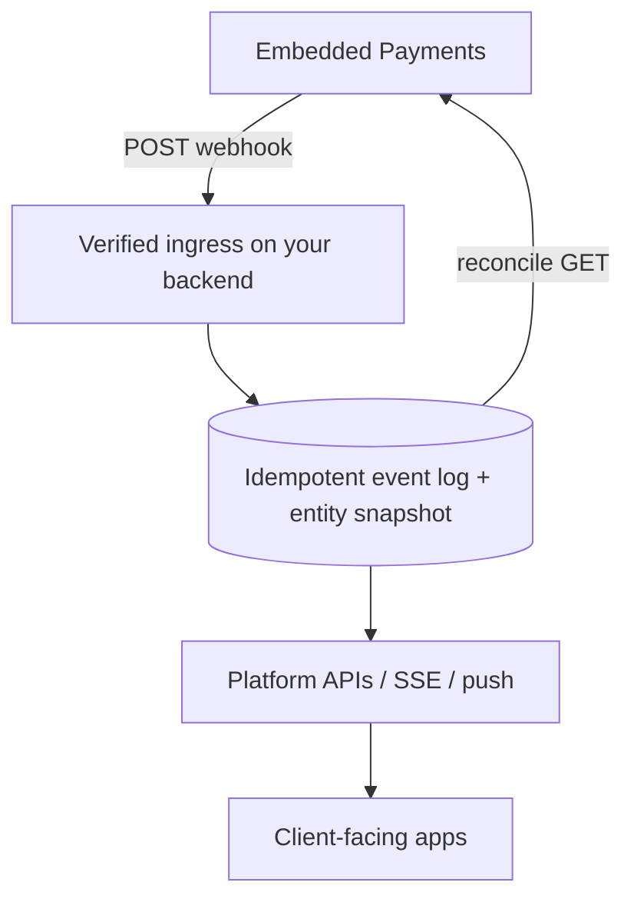

# Notifications (webhooks)

Subscribe to Embedded Payments events, verify inbound deliveries, and update platform state for client-facing apps.

## When to use

- Onboarding status changes without polling alone
- Transaction outcomes, ACH returns, NOC
- Recipient validation reminders / expiry
- Account risk thresholds

## Docs

| Resource | URL |
| --- | --- |
| Manage notifications | https://developer.payments.jpmorgan.com/docs/embedded-finance-solutions/embedded-payments/capabilities/notification-subscriptions/how-to/notifications |
| Notification payloads | https://developer.payments.jpmorgan.com/docs/embedded-finance-solutions/embedded-payments/capabilities/notification-subscriptions/how-to/notification-payloads |
| UX recipe | https://github.com/jpmorgan-payments/embedded-finance/blob/main/embedded-components/docs/WEBHOOK_INTEGRATION_RECIPE.md |

## Architecture

## High-value event types

| Event type | Use |
| --- | --- |
| `CLIENT_ONBOARDING` | KYC / due diligence status |
| `TRANSACTION_COMPLETED` / `TRANSACTION_FAILED` | Payment outcomes |
| `TRANSACTION_CHANGE_REQUESTED` | NOC — fix recipient data |
| `ACCOUNT_CREATED` / `ACCOUNT_CLOSED` / `ACCOUNT_OVERDRAWN` | Account lifecycle / risk |
| `RECIPIENT_ACCOUNT_VALIDATION` | Subscribe with this type; granular ready/reminder/expired appear on payloads |
| `THRESHOLD_LIMIT` | Program negative-balance limits — treat as critical |

Start with the minimum set for the current milestone; expand later.

## Implementation steps for the agent

1. Implement subscription management per PDP how-to (create/list/update subscription endpoints as documented).
2. Build an HTTPS ingress that:
   - Verifies authenticity per current portal guidance (do not skip in production)
   - Responds quickly (enqueue work; avoid long synchronous chains)
   - Is idempotent on delivery retries
3. Upsert an event log, then **reconcile** by calling GET on the affected resource (`/clients/{id}`, `/transactions/{id}`, …).
4. Fan out to client apps (SSE/WebSocket/push) with a poll fallback.
5. Map onboarding and payment events to clear UX (status + next action) using the webhook recipe — no internal ids in consumer copy.

## Onboarding note

"Ready for submission" may be **derived** (requirements complete, not yet submitted) with **no** webhook — pair notification handling with `GET /clients/{id}` outstanding requirements.

## Rules

- Webhook handlers run only on the server.
- Prefer reconcile-on-event over trusting the payload as sole authority for compliance-sensitive transitions.
- Do not process EF&S webhooks exclusively in the browser.
