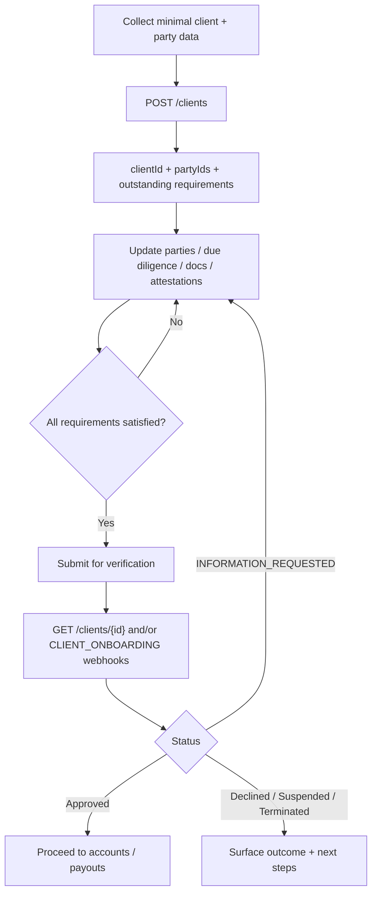

# Onboard a client

Create and complete verification for organizations or individuals on your platform so they can receive limited accounts and use Embedded Payments.

## When to use

- Marketplace / SaaS seller or business KYC
- Collecting party, due diligence, documents, and attestations before money movement
- Driving UI from outstanding requirements returned by the API

## Docs

| Resource | URL |
| --- | --- |
| How-to | https://developer.payments.jpmorgan.com/docs/embedded-finance-solutions/embedded-payments/capabilities/onboard-a-client |
| API reference | https://developer.payments.jpmorgan.com/api/embedded-finance-solutions/embedded-payments/overview |
| Connectivity / sandbox Q&A | https://github.com/jpmorgan-payments/embedded-finance/blob/main/embedded-components/docs/CONNECT_TO_API_QA.md |
| Testing catalog | https://github.com/jpmorgan-payments/embedded-finance/blob/main/embedded-components/docs/TESTING_CATALOG.md |
| UX flow recipe (optional) | https://github.com/jpmorgan-payments/embedded-finance/blob/main/embedded-components/docs/DIGITAL_ONBOARDING_FLOW_RECIPE.md |

## Flow



## Typical operations (confirm paths against current OAS)

- `POST /clients` — create client with products, partyType, roles, organization/individual seed data
- `GET /clients/{id}` — status + outstanding requirements
- Party update endpoints for controllers / beneficial owners
- Due diligence question answers
- Document upload / document-request handling
- Attestations
- Final submit / verification trigger as documented in the how-to

Sandbox onboarding root commonly hangs off:

```text
https://api-sandbox.payments.jpmorgan.com/onboarding/v1
```

Confirm the exact path prefix for your entitlement and OAS version before coding.

## Implementation steps for the agent

1. Import the project's existing EF&S HTTP client (do not add auth here).
2. Create a small service module (e.g. `src/efs/onboarding/clients.ts`) with typed wrappers for create/get/update/submit.
3. Model **outstanding requirements** as the source of truth for progressive UX (missing party fields, questions, docs, attestations).
4. Persist `clientId` / `partyId`s in the platform's own datastore after create.
5. Prefer webhook-driven status (`CLIENT_ONBOARDING`) with `GET /clients/{id}` reconciliation — see `notifications.md` for a follow-on change.
6. Sandbox-test with Testing Catalog magic values (document-request scenarios, etc.).

## Status UX cues (for API consumers building UI)

| State | Platform guidance |
| --- | --- |
| New / received | Show progress start + expected timeline |
| Ready for submission (often derived) | Strong CTA to submit when requirements empty but not submitted |
| Review in progress | Passive status; avoid duplicate submits |
| Information requested | Action list from outstanding requirements |
| Approved | Unlock accounts / payouts features |
| Declined / Suspended / Terminated | Clear outcome; disable restricted actions |

## Rules

- Stagger collection: minimal create first, then patch — matches PDP guidance.
- Never trust client-supplied status alone; re-read `GET /clients/{id}` after mutations.
- Do not invent document or party field names — copy from current OAS examples.
