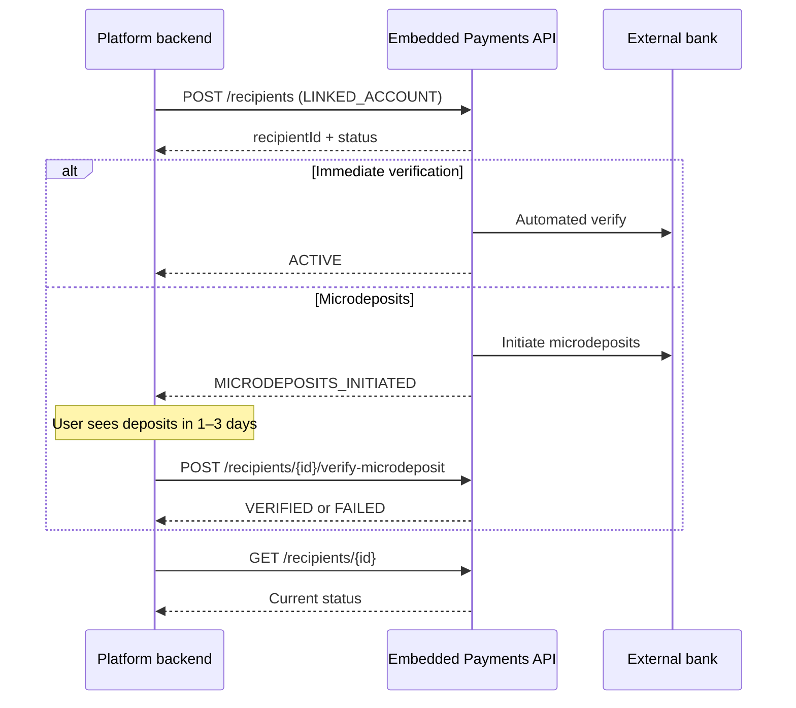

# Recipients / linked accounts

Add external bank accounts (recipients) for a client and verify them — including microdeposit flows when instant verification is unavailable.

## When to use

- Link a seller's external bank account for payouts
- Manage payment counterparties / recipients
- Verify accounts via microdeposits

## Docs

| Resource | URL |
| --- | --- |
| API overview | https://developer.payments.jpmorgan.com/api/embedded-finance-solutions/embedded-payments/overview |
| Linked accounts recipe | https://github.com/jpmorgan-payments/embedded-finance/blob/main/embedded-components/docs/LINKED_ACCOUNTS_RECIPE.md |
| Example walkthrough | `../examples/linked-account-flow.md` |

## Flow

## Typical operations (confirm against OAS)

- `POST /recipients` — add linked account / recipient (`type: LINKED_ACCOUNT` or other recipient types per docs)
- `GET /recipients/{id}` / list recipients
- `POST /recipients/{id}/verify-microdeposit` — submit microdeposit amounts
- Update / remove operations as exposed by the current API

## Implementation steps for the agent

1. Build a recipients service on top of the existing EF&S client.
2. Validate routing/account numbers client-side before POST; mask account numbers in UI and logs.
3. Branch UX on status: `ACTIVE` vs `MICRODEPOSITS_INITIATED` vs failed states.
4. For microdeposits: collect amounts once, handle retry/lockout per API error semantics, show expiry messaging if the program has one.
5. Optionally subscribe to `RECIPIENT_ACCOUNT_VALIDATION` (and related payload types) via `notifications.md`.

## UX cues

- Explain why linking is needed and how microdeposits work before asking for bank details.
- Never echo full account numbers after save — show masked values.
- Poll or webhook-refresh status; don't assume immediate ACTIVE.

## Rules

- Sensitive fields stay on the server boundary; browser only sees masked DTOs.
- Use current OAS enums for account type, party linkage, and status — don't hardcode stale strings from old samples.
