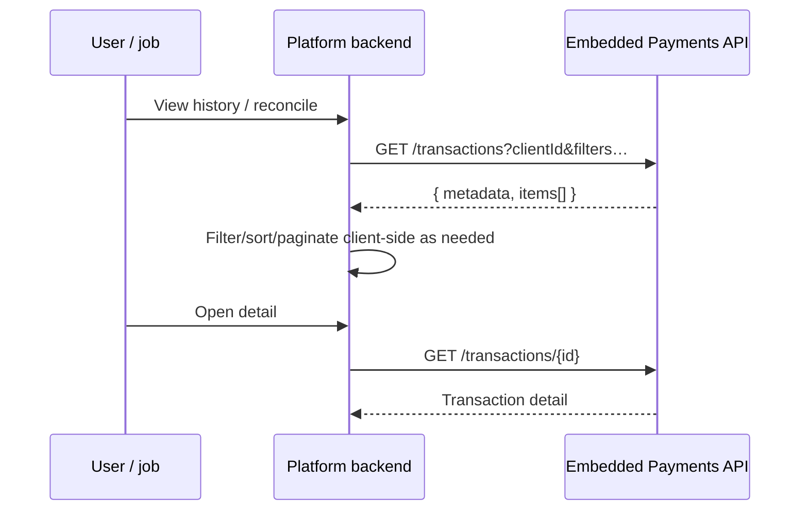

# Transactions / payouts

List, inspect, and initiate Embedded Payments money movement (ACH, wire, RTP, book transfer, etc. per program).

## When to use

- Transaction history / activity feeds
- Reconciliation jobs
- Triggering payouts to clients or external counterparties

## Docs

| Resource | URL |
| --- | --- |
| Manage & display transactions | https://developer.payments.jpmorgan.com/docs/embedded-finance-solutions/embedded-payments/capabilities/embedded-payments/how-to/manage-display-transactions-v2 |
| List / get transactions API | https://developer.payments.jpmorgan.com/api/embedded-finance-solutions/embedded-payments/embedded-payments/transactions |
| List-transactions recipe | https://github.com/jpmorgan-payments/embedded-finance/blob/main/embedded-components/docs/LIST_TRANSACTIONS_RECIPE.md |
| Notifications (for async outcomes) | `notifications.md` |

## List / get flow

### Known list constraint (as of OSS recipe)

`GET /transactions` may return `metadata` with page-like fields **without** accepting `page` / `limit` / cursor request params. Keep result sets small with **rich filters** (`clientId`, date bounds, status, type, etc.) and paginate in your platform layer. Re-verify against the OAS version you generate from — behavior can change.

## Initiate payout / transfer

Follow the current how-to and OAS for create-payment / transfer operations (paths and bodies vary by rail: ACH, wire, RTP, internal transfer).

Agent checklist:

1. Resolve funding `accountId` and destination (recipient id or account id) from platform state.
2. Generate an idempotency / request key if the API supports one — store it before the call.
3. POST the payment payload via the existing EF&S client.
4. Persist the returned transaction id and initial status.
5. Complete the journey with webhooks (`TRANSACTION_COMPLETED`, `TRANSACTION_FAILED`, `TRANSACTION_CHANGE_REQUESTED`) plus GET detail for reconciliation.

## Implementation steps for the agent

1. Generate or hand-write thin wrappers for list/get (and create, if in scope) from the OAS the project already uses.
2. Centralize filter builders so UIs and jobs share the same query rules.
3. Map status enums to UI badges consistently (`PENDING`, `COMPLETED`, `REJECTED`, `RETURNED`, … — use OAS enums).
4. For large histories, prefer date-windowed fetches over unbounded pulls.
5. Surface NOC / change-requested events as actionable recipient corrections, not generic failures.

## Rules

- Money-movement calls stay on the **server**.
- Never log full account numbers or raw PII from transaction payloads.
- Treat webhook + GET detail as the authority for final status, not the create response alone.
